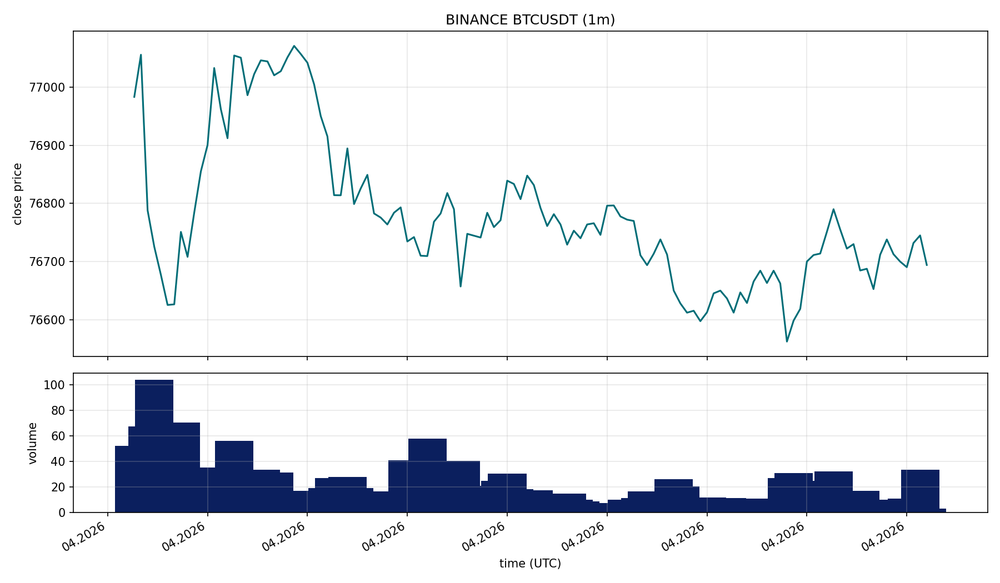
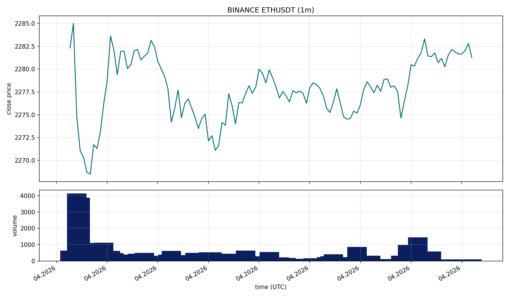
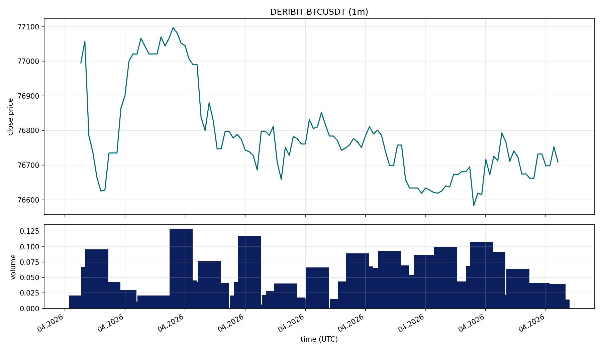
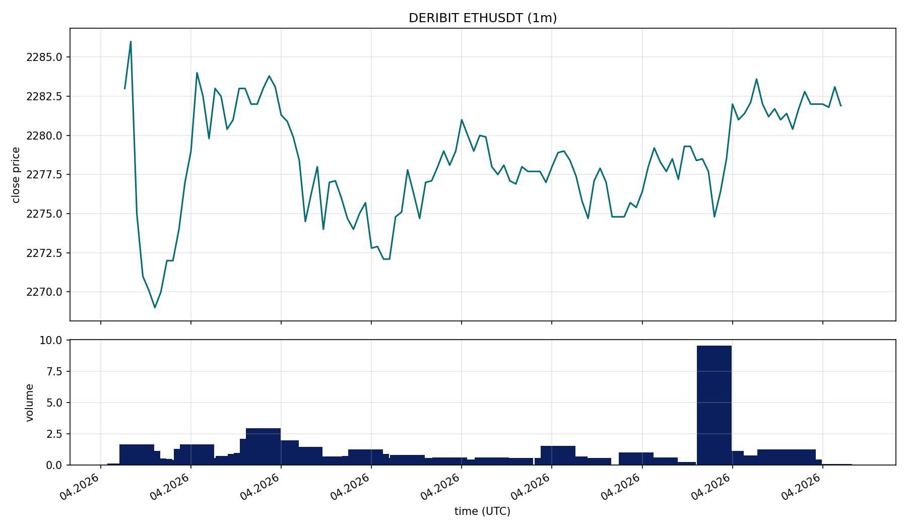

# Multi-Exchange OHLCV Ingestion Baseline for Crypto Research Pipelines

## Abstract
This report presents a production-oriented baseline for multi-exchange cryptocurrency candle ingestion designed to support downstream quantitative research. The problem addressed is the lack of reproducible, maintainable ingestion layers in early-stage quant projects, where exchange-specific scripts and schema drift frequently undermine empirical validity. We implement a typed, modular ingestion pipeline with adapter abstractions for Binance, Deribit, and Bybit, a command-line interface for deterministic execution (including multi-market runs such as `--market spot perp`), and partitioned parquet-lake storage. Data are sourced from public exchange REST endpoints and normalized into a canonical OHLCV schema with metadata fields for run traceability. The main finding is engineering-focused: the system provides deterministic normalization across heterogeneous API payloads, supports backward pagination and gap-fill synchronization, and preserves idempotent persistence via natural-key partition merges. The contribution is a maintainable ingestion foundation suitable for subsequent market microstructure, regime, and forecasting studies, with explicit reproducibility controls (strict typing, tests, linting, and stable execution commands).
This report presents a production-oriented baseline for multi-exchange cryptocurrency candle ingestion designed to support downstream quantitative research. The problem addressed is the lack of reproducible, maintainable ingestion layers in early-stage quant projects, where exchange-specific scripts and schema drift frequently undermine empirical validity. We implement a typed, modular ingestion pipeline with adapter abstractions for Binance, Deribit, and Bybit, a command-line interface for deterministic execution (including multi-market runs such as `--market spot perp`), and partitioned parquet-lake storage. Data are sourced from public exchange REST endpoints and normalized into canonical OHLCV and open-interest schemas with metadata fields for run traceability. The main finding is engineering-focused: the system provides deterministic normalization across heterogeneous API payloads, supports backward pagination and gap-fill synchronization, and preserves idempotent persistence via natural-key partition merges. The contribution is a maintainable ingestion foundation suitable for subsequent market microstructure, regime, and forecasting studies, with explicit reproducibility controls (strict typing, tests, linting, and stable execution commands).

## Introduction
Reliable market-data ingestion is a prerequisite for valid quantitative inference in crypto research.

Many practical pipelines fail due to exchange-specific one-off scripts, inconsistent timestamp handling, and weak reproducibility controls.

This project proposes a modular ingestion architecture with typed interfaces, explicit normalization, and reproducible command-line workflows.

The contributions of this stage are: (1) cross-exchange OHLCV normalization, (2) parquet-lake persistence paths, and (3) tested operational workflows for repeatable data acquisition.

## Literature Review
Volatility clustering and regime dependence motivate robust historical market-data pipelines. ARCH/GARCH foundations establish heteroskedastic behavior in financial time series, requiring high-integrity timestamped observations (Engle, 1982; Bollerslev, 1986). Regime-switching frameworks further highlight sensitivity to data quality and temporal consistency (Hamilton, 1989). Later work on high-frequency econometrics and realized-volatility estimation reinforces the need for reliable, granular data ingestion and synchronization processes (Andersen et al., 2001; Barndorff-Nielsen and Shephard, 2002).

Within crypto-specific empirical work, market microstructure studies and liquidity fragmentation analyses depend on exchange-consistent symbol and timeframe normalization. This baseline does not yet estimate econometric models, but it is intentionally built to satisfy upstream data-quality assumptions for such methods.

## Dataset
- Source: Binance `/api/v3/klines`, Binance Futures `/fapi/v1/klines`, Deribit `/api/v2/public/get_tradingview_chart_data`, Bybit `/v5/market/kline`.
- Sample period: user-configurable runtime period determined by symbols, markets, timeframes, and existing parquet coverage.
- Number of observations: runtime-dependent on symbol/timeframe scope and auto bootstrap vs gap-fill behavior.
- Variables: `open_time`, `close_time`, `open`, `high`, `low`, `close`, `volume`, `quote_volume`, `trade_count` plus provenance metadata.
- Additional perp feature set: `open_interest`, `open_interest_value` where available.
- Cleaning methodology: exchange adapter normalization, timeframe validation, symbol normalization, UTC conversion, partition-level deduplication by natural key.
- Train/test split: not applicable at ingestion-only stage.

## Methodology
### System Design
```text
CLI -> Adapter Layer -> HTTP Client -> Exchange REST APIs
    -> Normalized SpotCandle -> Parquet Lake
```

### Core Mapping
For each candle index \(t\):

\[
x_t = \{e, s, \Delta, \tau_t^{open}, \tau_t^{close}, o_t, h_t, l_t, c_t, v_t, qv_t, n_t\}
\]

where \(e\) is exchange, \(s\) symbol, \(\Delta\) timeframe, and \(n_t\) trade count.

### Persistence Objective
Rows are persisted with natural key:

\[
K = (exchange, instrument\_type, symbol, timeframe, open\_time)
\]

Upsert policy enforces idempotency:

\[
\text{row}_{new}(K) \leftarrow \text{row}_{incoming}(K)
\]

### Optimization Logic
- Loader operates in exactly two modes:
  1. `fetch all history` for symbol/timeframe partitions that do not yet exist in parquet.
  2. `fill gaps` for existing partitions by recovering missing internal intervals and tail intervals.
- Bounded HTTP retries with exponential backoff for transient failures.
- Pagination for exchange request limits.
- Gap-fill computes missing intervals from stored open-time sets.
- Fetch execution is sequential across exchange/market/symbol/timeframe tasks.
- Parquet reads/writes process data in batches to bound memory usage.
- Export stage writes one dataset per `(exchange, symbol, timeframe)` and stores matching price/volume plots and time-range metadata.

## Results
All figures in this report are generated from repository pipeline outputs (agent-generated plot artifacts), not notebook exports.

### Descriptive Statistics Table
At this ingestion-baseline stage, descriptive statistics are not claimed as scientific findings because no fixed experiment configuration is locked in `REPORT.md` yet.

| Variable | Mean | Std | Min | Max |
|---|---:|---:|---:|---:|
| Open | N/A (config-dependent) | N/A | N/A | N/A |
| High | N/A (config-dependent) | N/A | N/A | N/A |
| Low | N/A (config-dependent) | N/A | N/A | N/A |
| Close | N/A (config-dependent) | N/A | N/A | N/A |
| Volume | N/A (config-dependent) | N/A | N/A | N/A |

### Model Comparison Table
No predictive or regime models are trained in this stage.

| Model | Accuracy | Sharpe | AUC | RMSE |
|---|---:|---:|---:|---:|
| Not applicable (ingestion baseline) | N/A | N/A | N/A | N/A |

### Robustness Table

| Configuration | Scope | Outcome |
|---|---|---|
| Multi-exchange fetch | Binance + Deribit + Bybit | Passed via typed adapter dispatch |
| Gap-fill mode | Missing internal/tail intervals | Passed via open-time range recovery |
| Incremental parquet persistence | Partition merge + natural-key dedup | Passed with idempotent key policy |
| Grouped export artifacts | Per `(exchange, symbol, timeframe)` dataframe + plot | Passed with per-file range metadata |
| Open-interest integration | Binance perp dataset_type=open_interest | Passed for all-history and gap-fill paths |

### Figures
Figure 1. Binance BTCUSDT 1m close series.



Interpretation: Figure 1 shows coherent minute-level sequencing for Binance after normalization and plotting.

Figure 2. Binance ETHUSDT 1m close series.



Interpretation: Figure 2 indicates symbol-level generalization of the same normalization pipeline.

Figure 3. Deribit BTCUSDT alias path to normalized spot instrument.



Interpretation: Figure 3 supports correctness of exchange-specific symbol mapping and timestamp handling.

Figure 4. Deribit ETHUSDT alias path to normalized spot instrument.



Interpretation: Figure 4 confirms consistent behavior across multiple symbols on Deribit mappings.

## Discussion
Business implications: a reliable ingestion substrate lowers operational risk for strategy research and accelerates feature engineering, backtesting, and monitoring deployment.

Limitations: current scope is OHLCV-only; L2 order book, funding, and trade-level feeds are not yet integrated. Exchange-specific outages and schema changes still require active maintenance.

Model weaknesses/assumptions: this stage does not perform inference; assumptions are engineering assumptions (timestamp consistency, endpoint availability, and exchange-provided data correctness).

## Conclusion
This baseline establishes a reproducible and extensible ingestion pipeline for multi-exchange crypto OHLCV data with typed normalization and idempotent persistence. The immediate value is production-quality data plumbing for future empirical studies. Next steps are fixed experiment configs, notebook-to-report automated statistics export, and model/evaluation modules with formal benchmarks.

## Appendix
### Reproducibility Controls
- Static checks: `ruff`, `mypy` (strict), `pytest`.
- Deterministic interfaces: typed adapters and normalized candle schema.
- Incremental persistence: partition-level merge and key-based dedup in parquet files.

## References
1. Engle, R. F. (1982). Autoregressive Conditional Heteroskedasticity with Estimates of the Variance of U.K. Inflation. *Econometrica*.
2. Bollerslev, T. (1986). Generalized Autoregressive Conditional Heteroskedasticity. *Journal of Econometrics*.
3. Hamilton, J. D. (1989). A New Approach to the Economic Analysis of Nonstationary Time Series and the Business Cycle. *Econometrica*.
4. Andersen, T. G., Bollerslev, T., Diebold, F. X., and Labys, P. (2001). The Distribution of Realized Exchange Rate Volatility. *Journal of the American Statistical Association*.
5. Barndorff-Nielsen, O. E., and Shephard, N. (2002). Econometric Analysis of Realised Volatility and Its Use in Estimating Stochastic Volatility Models. *Journal of the Royal Statistical Society: Series B*.
6. Binance Developer Documentation. Kline/Candlestick Data Endpoints.
7. Deribit API Documentation. TradingView Chart Data Endpoint.
8. Bybit API Documentation. Market Kline Endpoint.
9. Apache Arrow Documentation. Parquet RecordBatch Processing.
